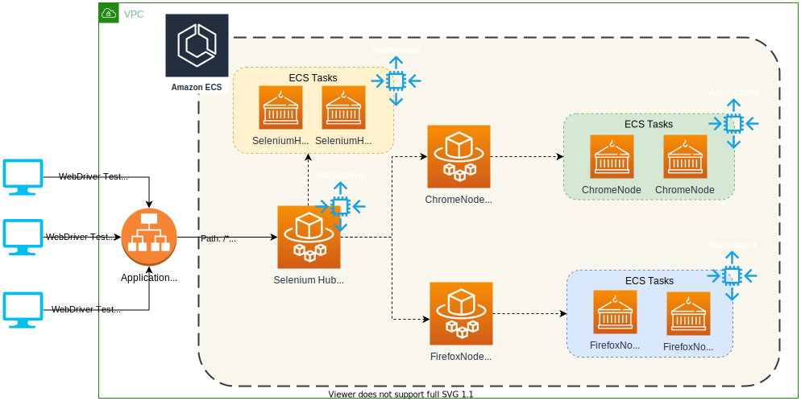
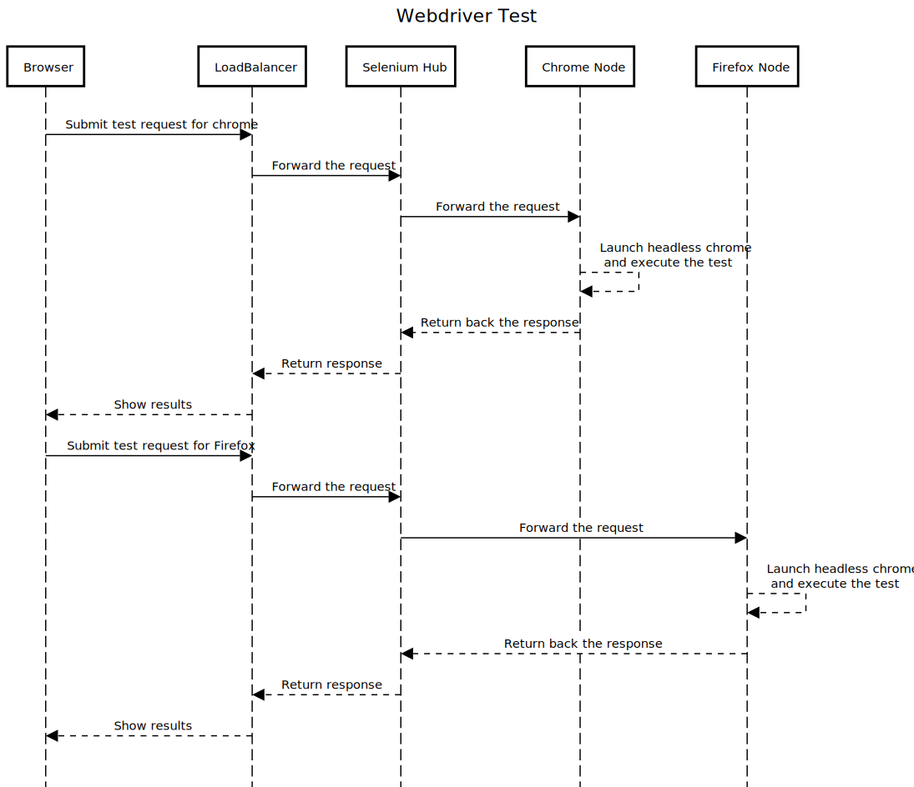
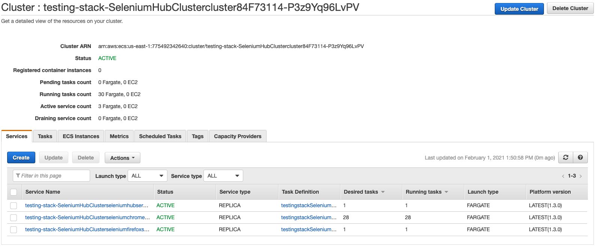
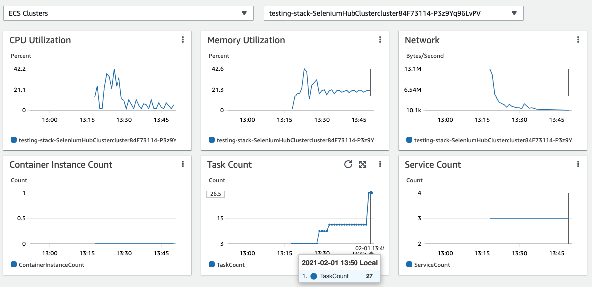
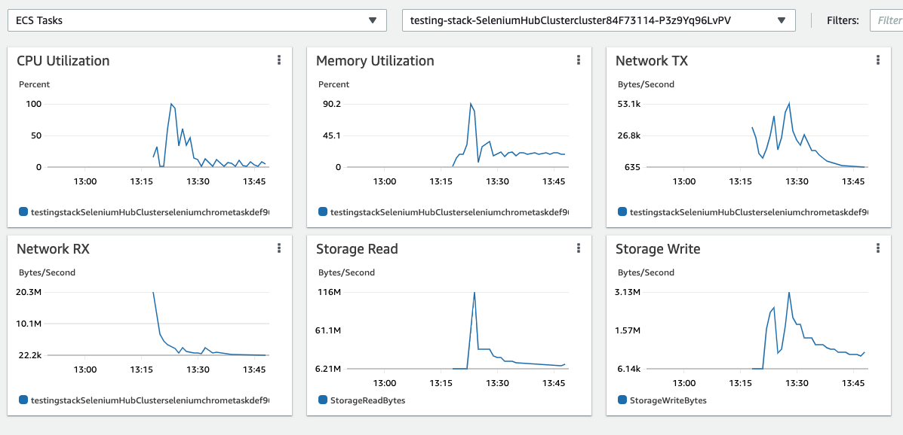
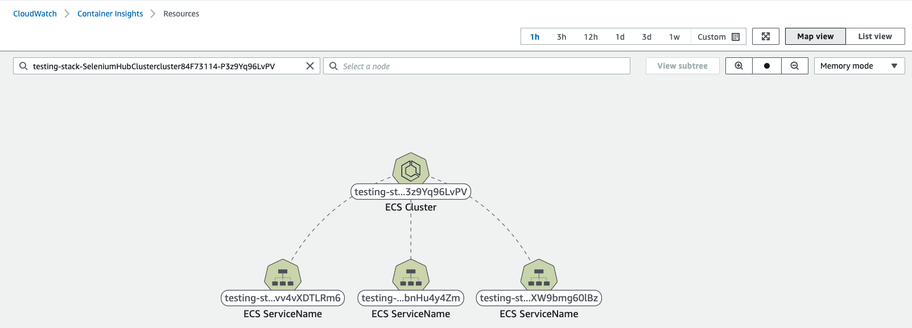
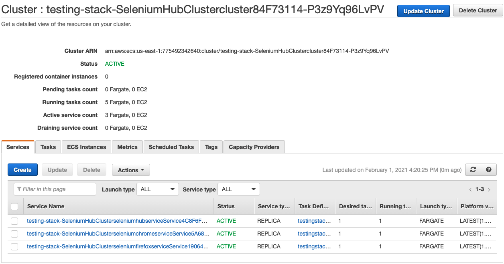

# Run selenium tests at scale using ECS Fargate

This article talks about an approach that can help customers run integration and regression tests quicker and cheaper to improve the CI/CD process.

# Introduction

Let us consider a scenario where the developer has added a new feature or made a bug fix to an existing product and checked the changes. As part of the CI/CD pipeline, the new code gets built, unit test cases are run and deployed in a QA or staging environment. Once the deployment is successful QA team will run the integration and regression test cases to certify the build. In a typical case, the number of test cases may vary between hundreds to a few thousand, so executing these test cases will take time, eventually slowing down the phase in which features get deployed in production. The traditional way of accelerating this test case execution is one of the following:

- Add more resources to the QA team so they can start these test case execution in parallel from multiple machines, monitor them, and collect results
- Add more physical machines or VM's, so we have enough browser agents to run these tests rather than relying on local machines

This method is not scalable and costs both money and time. The approach explained here focuses on this specific problem and walks through how we can run these test cases quicker without costing a lot of money and time.

> Note: The approach highlighted here is only applicable for testcases executed using selenium framework

## Security

See [CONTRIBUTING](CONTRIBUTING.md#security-issue-notifications) for more information.

## License

This library is licensed under the MIT-0 License. See the LICENSE file.


# Architecture

Here is the high-level view of all the components



### Notes

- `Selenium Hub` is used to parallelize and distribute the load between the browser agents for test case execution.
- The whole infrastructure gets deployed in ECS Cluster with the following strategy for the default capacity provider:
    - FARGATE -> Base: 4, Weight: 1
    - FARGATE_SPOT -> Weight: 4

> Note: Out of 5 instances, 4 of them will get provisioned as SPOT, and one of them will get provisioned as ON_DEMAND

- `Selenium Hub`,` "Chrome Node (selenium docker image with headless chrome)`, and `Firefox Node (selenium docker image with headless firefox)` are deployed as ECS services
- All ECS services have autoscaling enabled, with the following scale in and scale out policies:
    - Add three instances if `max(CPUUtilization) >= 70` in last 1 minute
    - Remove one instance if `max(CPUUtilization) <= 30` in last 1 minute
- `Selenium Hub` is backed by an "Application Load Balancer" to which web driver clients connect to run the tests
CloudWatch logs enable-Observability.

The code available in this repository is exposed as an CDK Construct, to learn more about CDK Construct click [here](https://docs.aws.amazon.com/cdk/latest/guide/constructs.html)

### Benefits

Here are some key benefits of using this approach:

- Depending upon the number of concurrent execution, `ChromeNode` & `FirefoxNode` will scale out and in automatically (as it impacts the CPUUtilization metrics), so the customer pay's only for the duration they use (no standing cost)
- Customer can deploy different browsers or different versions of the same browser depending upon the business need without thinking about the infrastructure or cost
- Based on the capacity provider strategy, most of the instances gets provisioned as `FARGATE_SPOT,` which costs way less money, so to facilitate quicker execution, scale quicker with more nodes
- With this approach, customers can now run the regression and integration test cases part of their nightly builds that would enable daily release cycle to support growing business needs.

# Test case execution

Here is the sequence of events that happens when we execute a test case using this architecture



# Build & Deploy

## Pre-requistes

- AWS CDK should be installed in the local laptop. You can read more about it [here](https://docs.aws.amazon.com/cdk/latest/guide/getting_started.html)
- ```Yarn``` needs to be installed, you can check the installation status by running this command

```bash
yarn version
```

**Output**
1.22.10

- If ```Yarn``` is not installed run the following command

```bash
npm install -g yarn
```

- An AWS account and console access

## Deployment

- Check out the code from this repository using this command:

```bash
mkdir scaling-test-execution && cd scaling-test-execution
git clone hhttps://github.com/hariohmprasath/scaled-test-execution.git .
```

- As the code is created as a CDK construct, the following parameters can be customized as part of the deployment

| Parameter  | Description | Default |
| ------------- | ------------- | ----|
| vpc  |  VPC in which the resources needs to be created | New VPC will be created |
| seleniumVersion | Selenium version used in the docker image  | 3.141.59 |
| memory | Memory settings for hub and chrome fargate nodes | 512 |
| cpu | CPU settings for hub and chrome fargate nodes | 256 |
| seleniumNodeMaxInstances | Selenium `NODE_MAX_INSTANCES` pointing to the number of instances of the same version of browser that can run in node | 5 |
| seleniumNodeMaxSessions | Selenium `NODE_MAX_SESSION` pointing to the number of browsers (Any browser and version) that can run in parallel at a time in node | 5 |
| minInstances | Minimum number of instances for autoscaling chrome, firefox and selenium services | 1 |
| maxInstances | Maximum number of instances for autoscaling chrome, firefox and selenium services | 10 |

- Run the following command to start the deployment

```bash
cdk deploy --require-approval never
```

> Once the deployment is successful, you should see the 'Selenium-Hub-DNS' in the CfnOutput.

The complete selenium hub load balancer URL will look like.

```bash
http://<<Selenium-Hub-DNS>>:4444/wb/hub
```

# Testing

## Unit testing

Unit testcases can be executed by running the following command from the root directory

```bash
yarn test
```

**Output**

```bash
$ npx projen test
🤖 test | rm -fr lib/
🤖 test » test:compile | tsc --noEmit --project tsconfig.jest.json
🤖 test | jest --passWithNoTests --all --updateSnapshot
PASS  test/hello.test.ts
✓ create app (730 ms)

----------|---------|----------|---------|---------|-------------------
File      | % Stmts | % Branch | % Funcs | % Lines | Uncovered Line #s
----------|---------|----------|---------|---------|-------------------
All files |     100 |       72 |     100 |     100 |
 index.ts |     100 |       72 |     100 |     100 | 61-70
----------|---------|----------|---------|---------|-------------------
Test Suites: 1 passed, 1 total
Tests:       1 passed, 1 total
Snapshots:   0 total
Time:        5.163 s
Ran all test suites.
🤖 test » eslint | eslint --ext .ts,.tsx --fix --no-error-on-unmatched-pattern src test build-tools .projenrc.js
✨  Done in 17.45s.
```

## Integration testing (using webdriver)

A sample test case can you found under ```sample-test-function``` folder, you can run the following commands to build and execute the tests against the selenium hub load balancer url

```bash
cd sample-test-function && npm install
npx wdio --hostname <<Selenium-Hub-DNS>>
```

**Output**

All test cases should successfully pass and here is how it looks like

```bash
[chrome 87.0.4280.88 linux #0-0] Running: chrome (v87.0.4280.88) on linux
[chrome 87.0.4280.88 linux #0-0] Session ID: 80329f4643463a93a4628a35de4aaab4
[chrome 87.0.4280.88 linux #0-0]
[chrome 87.0.4280.88 linux #0-0] Play with google
[chrome 87.0.4280.88 linux #0-0]    ✓ navigate to the site
[chrome 87.0.4280.88 linux #0-0]    ✓ start a search
[chrome 87.0.4280.88 linux #0-0]
[chrome 87.0.4280.88 linux #0-0] 2 passing (8.2s)


Spec Files:	1 passed, 1 total (100% completed) in 00:00:10
```

## Load testing (using webdriver)

## Scale up

To simulate load test we ran the above mentioned testcase in parallel (closer to 10 concurrent session), which made the `CPUUtilization` to go above 70%, resulting in autoscaling.

Here are few screen shots captured using Container Insights and AWS ECS console

### AWS ECS Console

**ECS Tasks**


**ECS Service**



### Graphs using Container Insights

**ECS Cluster**



**ECS Tasks**



**Map view**



## Scale down

After successful test case execution the cluster will automatically scaling down when the `CPUUtilization` goes below 30% with a cooldown interval of 180 seconds

Here is the preview of ECS services running with just one instance after scaling down to the desired capacity



# Cleanup

Run the following command from root directory to delete the stack

```bash
cdk destroy
```

# Resources

- [Selenium Grid Using Docker](https://medium.com/@amartanwar93/selenium-grid-using-docker-ab66f15c657b)
- [Docker Selenium](https://github.com/SeleniumHQ/docker-selenium)
- [Running Selenium in Fargate](https://code.mendhak.com/selenium-grid-ecs/)